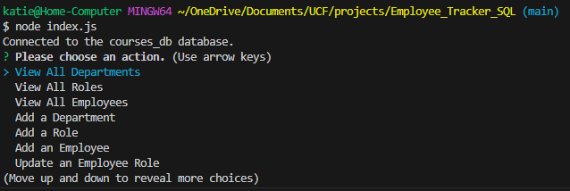

# Employee_Tracker_SQL

## Description

Track your employees, department, salaries and more with this backend tracker. 
You'll use node and SQL to view and change employee records. 

## Table of Contents

- [Installation](#installation)
- [Usage](#usage)
- [Credits](#credits)

## Installation
install - require inquirer@8.2.4, dotenv, mysql2

1. Use the command line to invoke the action questions.

     Use **node index.js** 

    

When choosing tasks that add/update the database, close the connection then re-open.

## Usage

Using arrow keys, navigate to the action you'd like to complete and hit Enter.

Below is a list of input required for each action ("view" options do not need input):

    ~ Add a Department: name of department

    ~ Add a Role: name of role, salary, department ID

    ~ Add an Employee: first name, last name, role ID, manager ID

    ~ Update an Employee Role: employee, new role ID

-------------------------------------------------
List of existing Department and Role IDs

    ~ 1 'Sales'
    ~ 2 'Marketing'
    ~ 3 'Accounting'
    ~ 4, 'HR'

    ~ 1, 'Sales Agent'
    ~ 2, 'Graphic Artist'
    ~ 3, 'Admin'
    ~ 4, 'Hiring Coord.'

Checkout this VSCode walkthrough video if you have any questions: [Walkthrough](https://drive.google.com/file/d/1N7U-ti4QqAvRgJogu1viidJTu9KAYnCb/view)

## Credits

Project created by Kathryn Dougherty with instruction from the UCF Coding Bootcamp.
Special Thanks to Dru for review. 